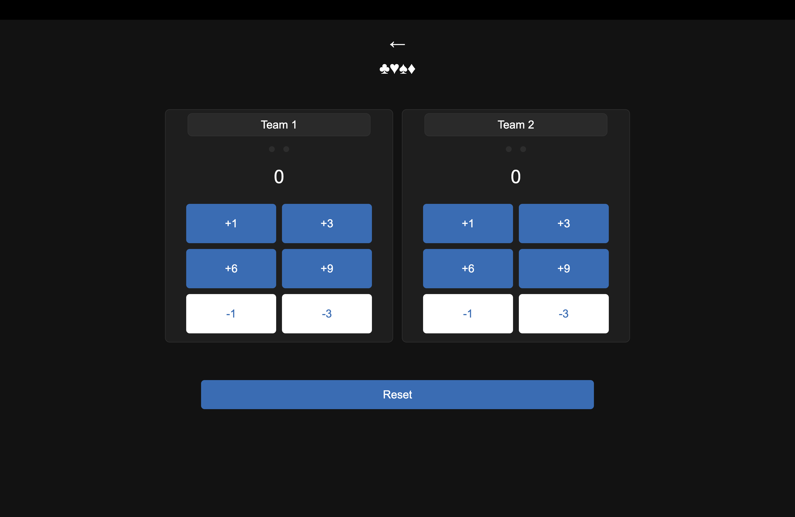
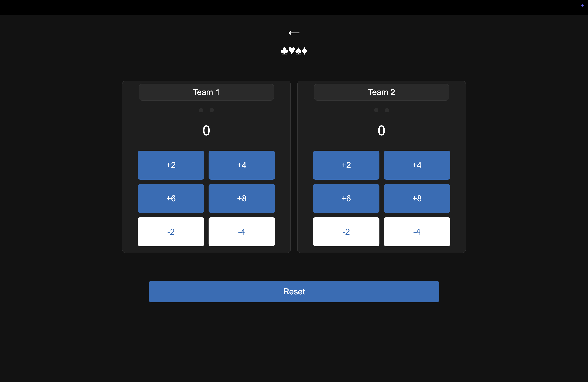
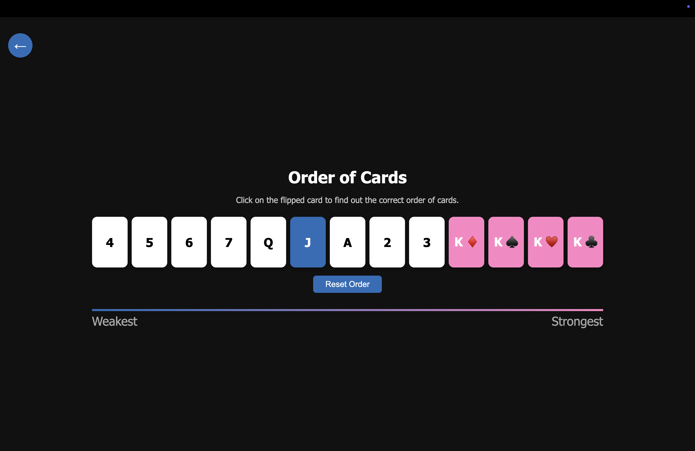
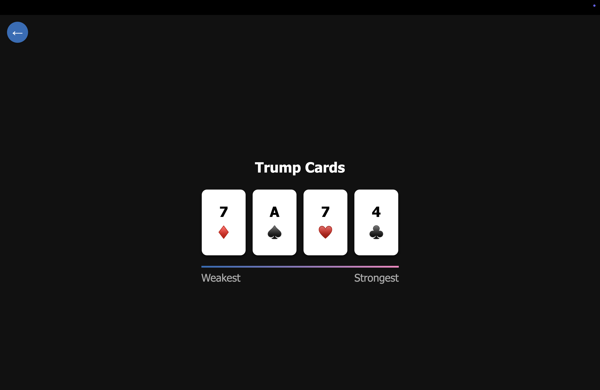

# Secco Truco 🃏

Welcome to **Secco Truco**, an interactive and intuitive platform for learning and playing **Truco**, one of Brazil’s most popular card games. Whether you’re new to the game or a seasoned player, Secco Truco helps you master the **card hierarchy**, **manilhas**, and **track game scores** with ease.

🌐 **Access the website here:** [https://www.seccotruco.com](https://www.seccotruco.com)

---

## 📸 Screenshots

## 📸 Screenshots

### Truco Paulista


### Truco Mineiro


### Order of Cards


### Trump Card



---

## 🎮 How to Play Truco

Truco is a trick-taking card game played mainly in Brazil. There are different regional variations — **Paulista (SP)** and **Mineiro (MG)** being the most common. Here’s a simplified explanation of the core game mechanics:

- The game is played with a 40-card deck (removing 8s, 9s, 10s and jokers).
- Cards have a non-standard ranking that can change depending on the flipped card, which defines the **manilha** (trump cards).
- Players score points by winning rounds. Bluffing and calling “Truco!” increases the stakes.
- The game is typically played with 2 teams of 2 players each.

---

## 📐 Website Features

### 🃏 Order of Cards Page

Understand the hierarchy of cards in **Truco Paulista** and **Truco Mineiro**:

- Click on a card to simulate the **vira** (turned card).
- The website highlights the **manilhas** — the strongest cards — which depend on the flipped card.
- All cards are displayed in order of strength from weakest to strongest.
- Animations enhance the experience and make it easy to visualize the power of each card.

🔗 [View the Card Order Page](https://www.seccotruco.com/order-of-cards)

---

### 🧮 Scoreboard Page

Track live game progress with an interactive scoreboard:

- Choose between **Paulista** or **Mineiro** style scoring.
- Click on the score icons to increment each team’s points.
- The scoreboard updates automatically and displays who is winning.
- Click “Reset” to start a new match anytime.

🔗 [View the Scoreboard](https://www.seccotruco.com/scoreboard)

---

## 🚀 Getting Started (For Developers)

If you're interested in contributing or running the project locally:

```bash
git clone https://github.com/your-username/secco-truco.git
cd secco-truco
# Open index.html in your browser or serve with a local HTTP server
```
---

## 🤝 Contribute

Do you love Truco and want to help this project grow?  
Feel free to open issues, suggest improvements, or contribute directly via pull requests!

## 📬 Contact

Made with ❤️ by Matheus  
Questions, ideas, or feedback? Reach out via GitHub or through the [contact form on the website](https://www.seccotruco.com/#contact).

## 🧵 License

This project is open source and available under the [MIT License](LICENSE).
